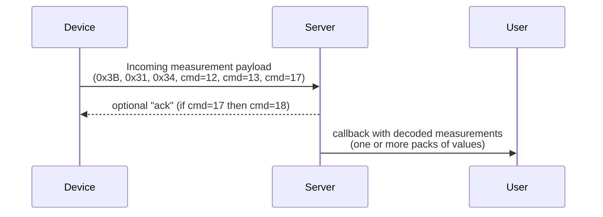
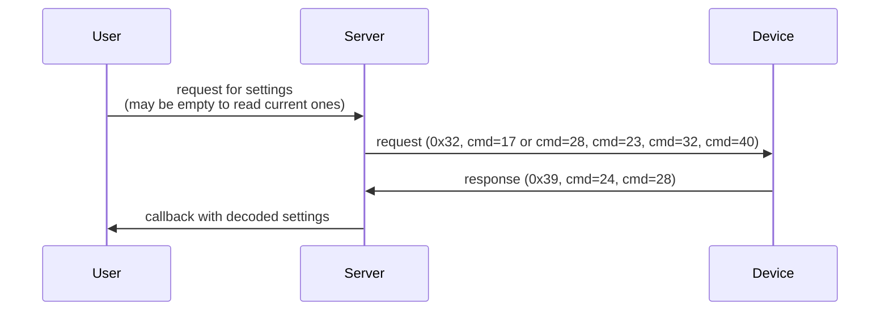
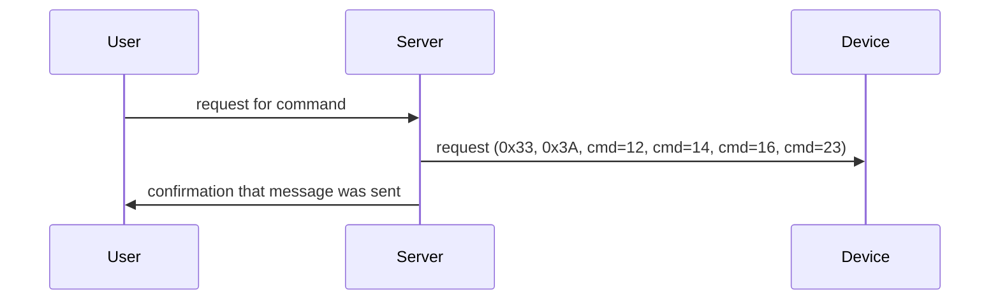

<!--
SPDX-FileCopyrightText: 2026-present Daniel Skowroński <GoQingpingIoTMQTT@skowronski.cloud>

SPDX-License-Identifier: BSD-3-Clause
-->
# Communication flows - simplified

## Device-initiated

### Measurements

## User-initiated two-way

## User-initiated one-way

## Omitted

- device pairing flows - BLE, HomeKit
- `cmd=19 Device Report Log`
- `cmd=20 Binding Status`
- `cmd=27 Binding Status For Third Part's Device`

---

# Communication interface

1. register callback for measurements -> function will be called when device initiates communication - this only happens when measurements are transmitted, so params are simply ID of calling device and iterable of measurement objects (each has timestamp, type, value, unit, flags etc.); if needed, internally sends ACK without user intervention
2. send command with optional parameters and return response or null if this was one-way communication: persistent configuration (intervals, offsets, units, NTP, MQTT, WiFi, upgrade targets) and temporary configuration (short-term rapid reporting); accepts list of parameters that are validated against supported list (per group, per model) and whether they can be requested in one message or not (e.g. setting MQTT is always separate command so it cannot be combined with intervals); list of parameters can be empty for requesting current data without changing anything; returns whatever device returned or simple ack if no response was expected
