<!--
SPDX-FileCopyrightText: 2026-present Daniel Skowroński <GoQingpingIoTMQTT@skowronski.cloud>

SPDX-License-Identifier: BSD-3-Clause
-->
# Communication flows - according to spec

## HEX Protocol

### Measurements

#### Standard measurements

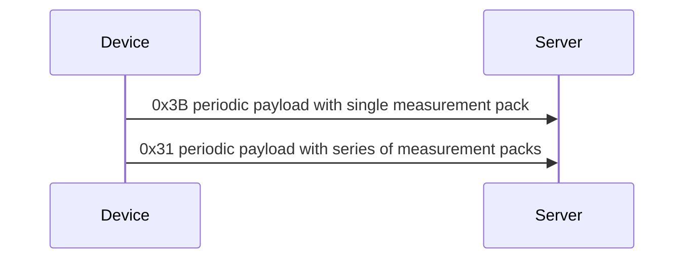

#### Event/alert

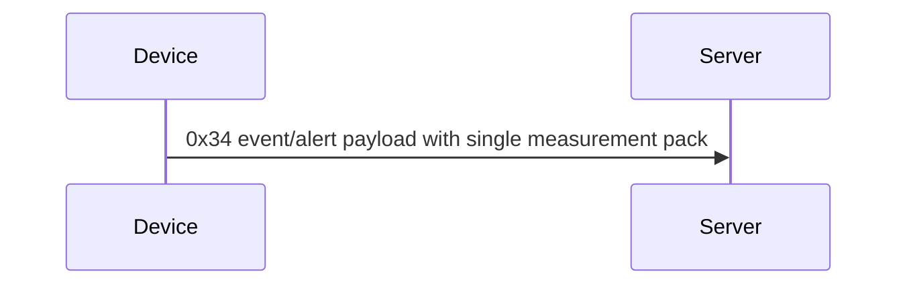

### Configuration and commands

#### Settings

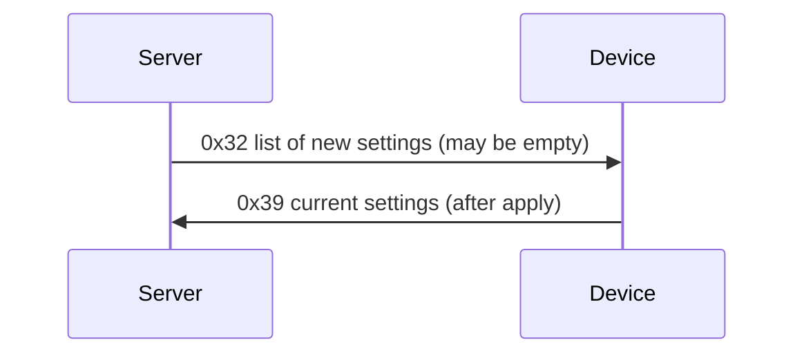

#### Initiate firmware upgrade

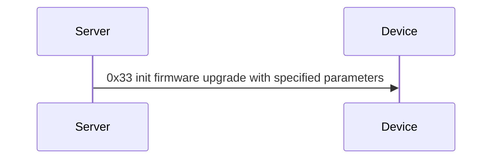

#### Reconfigure network

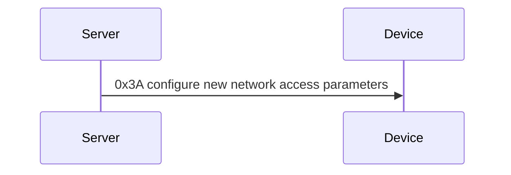

## JSON protocol

### Pairing flows

#### BLE flow

*not fully understdood*

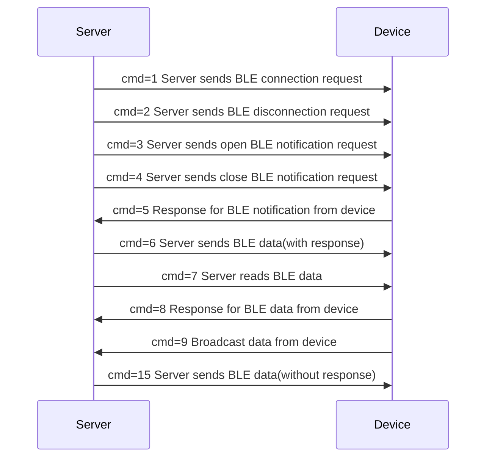

#### Device list flow

*not fully understdood, HomeKit?*

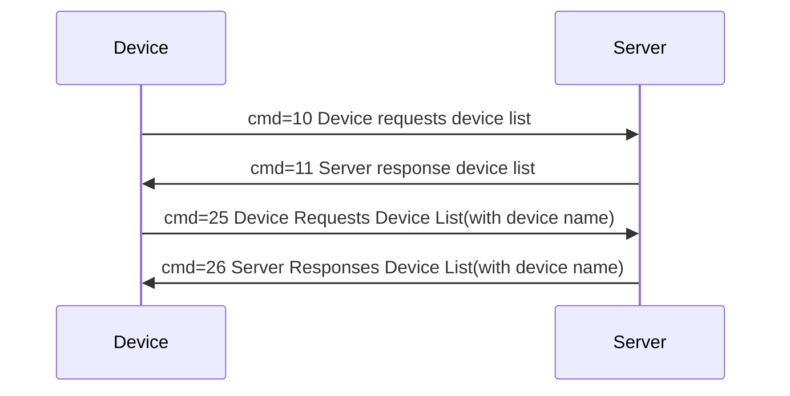

### Configuration and commands

#### Temporary rapid reporting

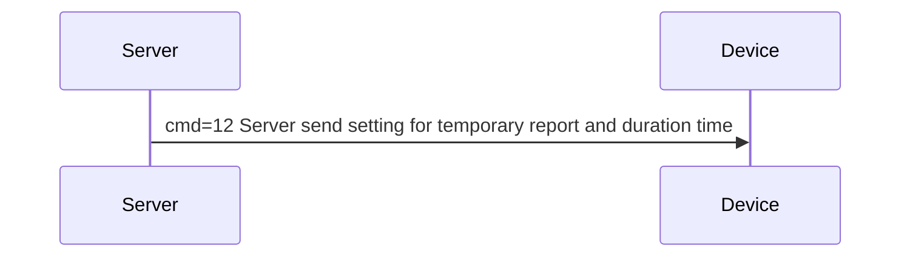

#### MQTT

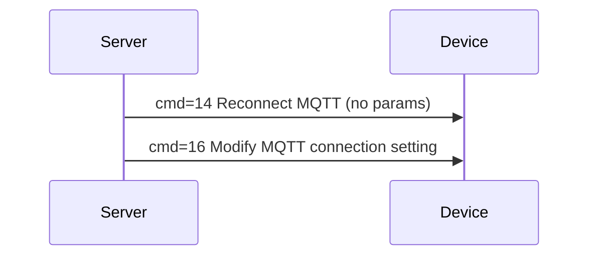

#### Settings

set:

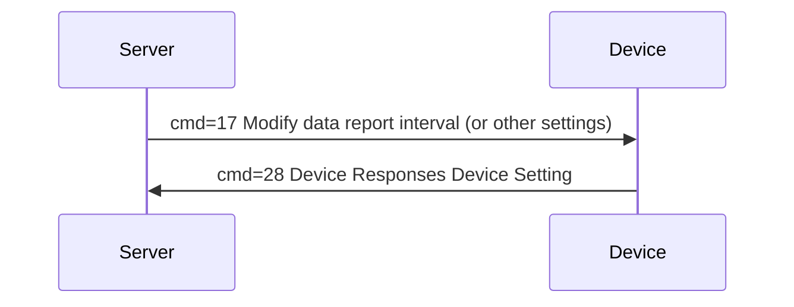

just read:

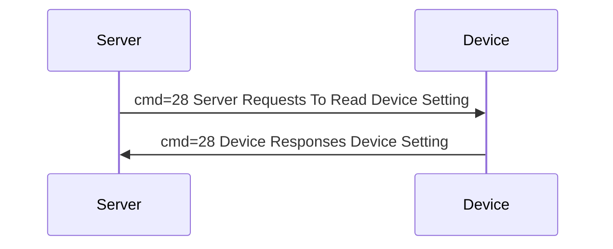

#### Notifications

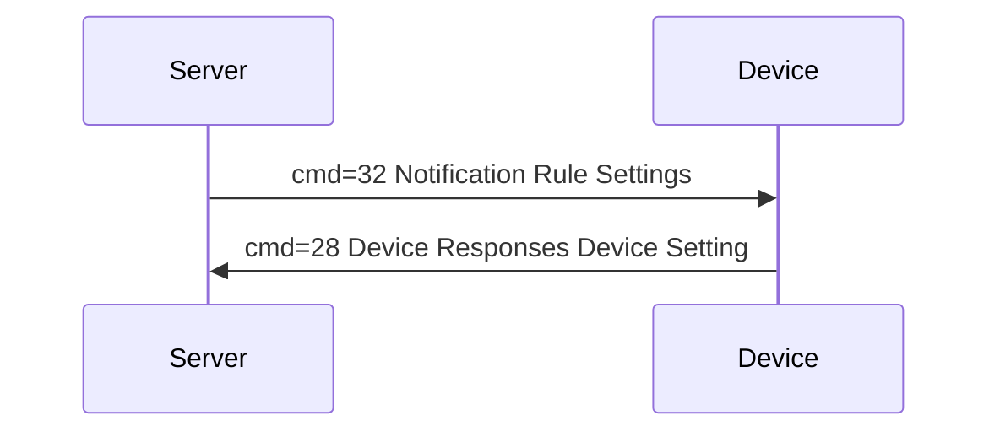

#### Alarm

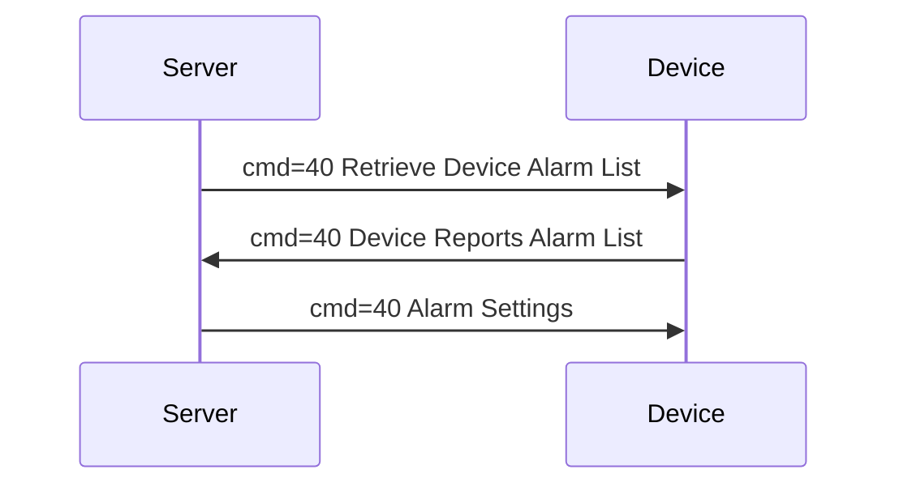

#### OTA

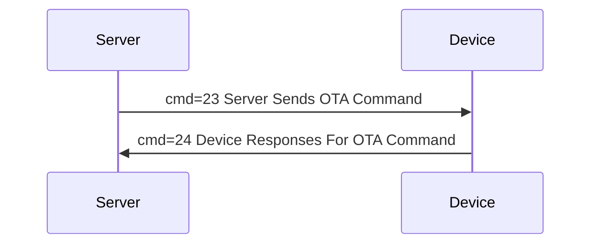

### Measurements

#### Heartbeat

*transmits WiFi info and confirms device is online*

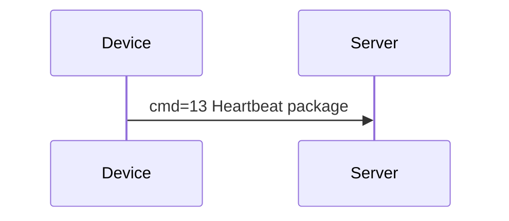

#### Real-time data

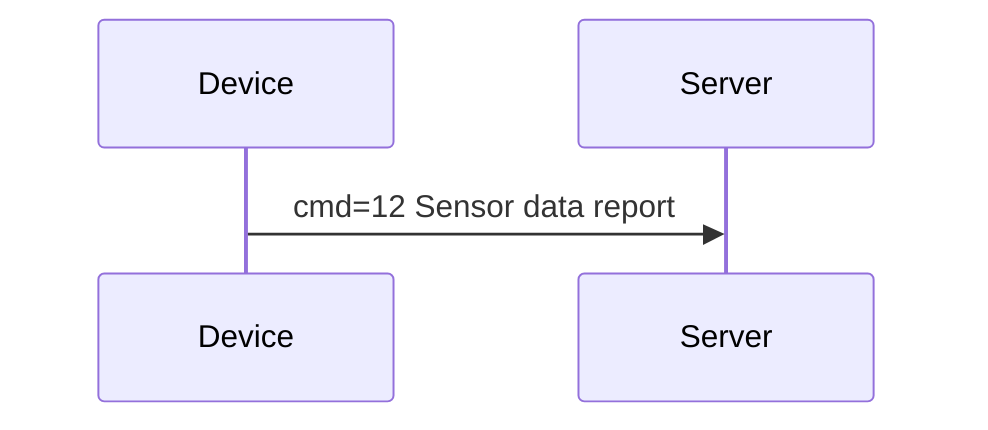

#### History data

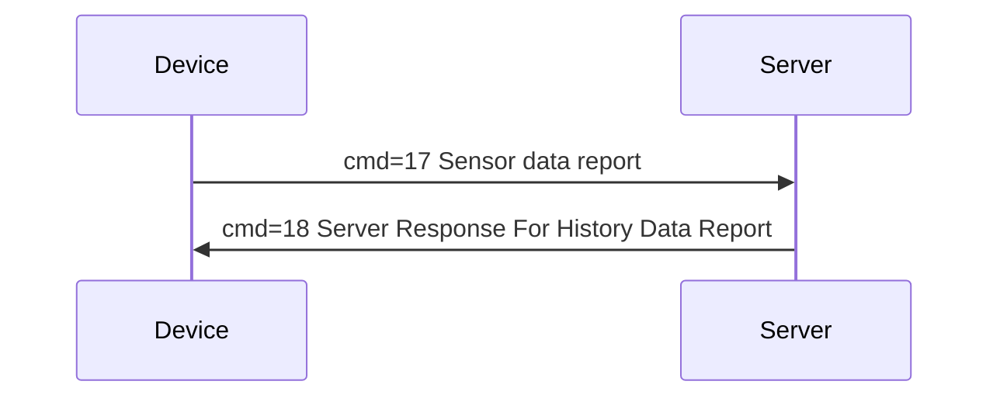

*response is obligatory, as it acts as primitive NTP*

### Completely unknown

- `cmd=19 Device Report Log`
- `cmd=20 Binding Status`
- `cmd=27 Binding Status For Third Part's Device`
